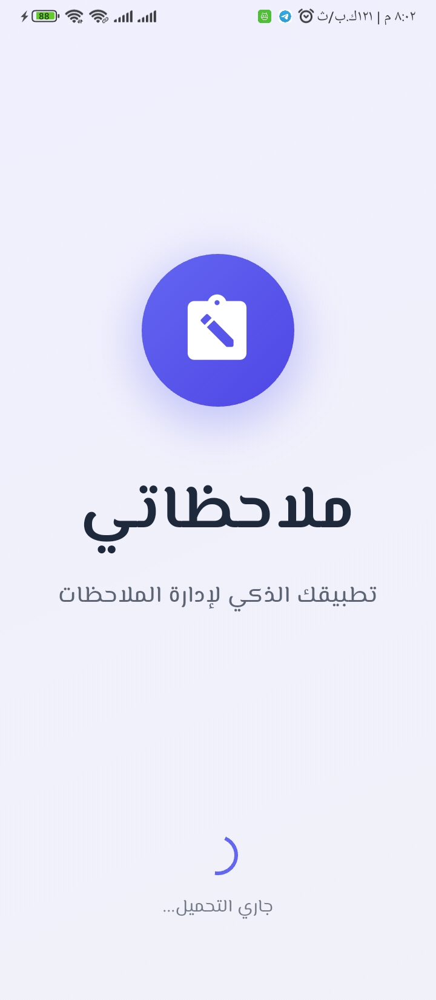
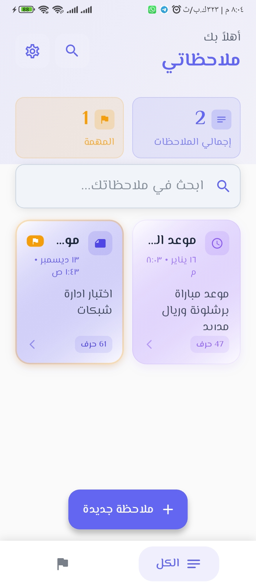
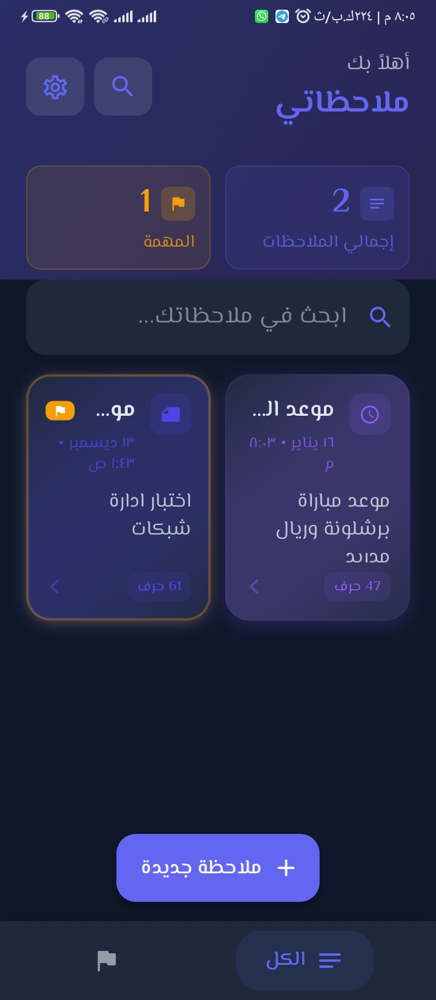
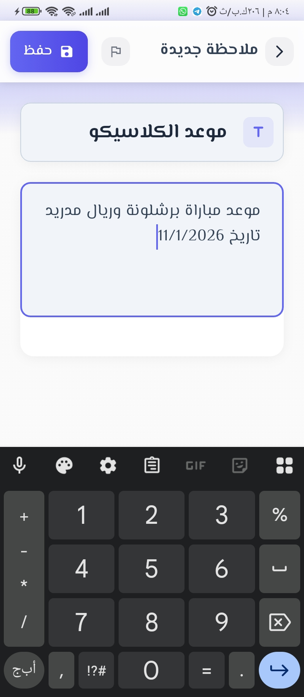
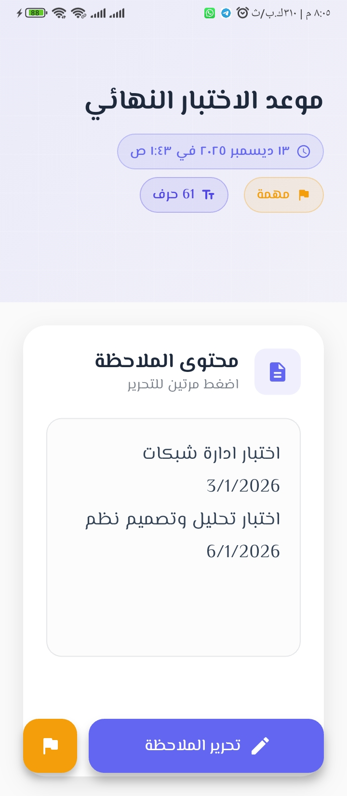
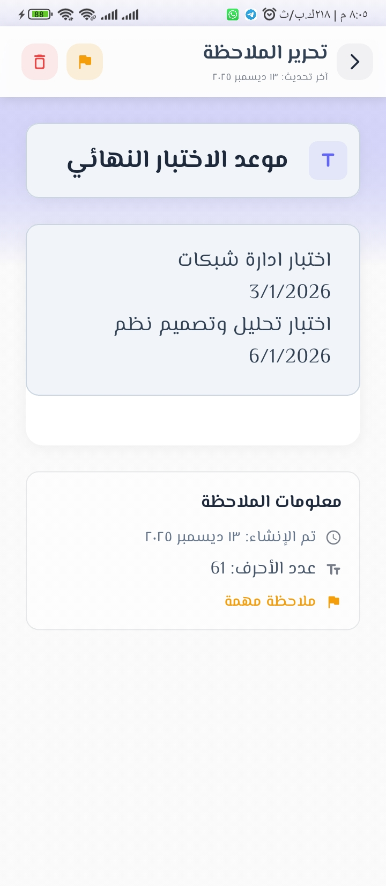
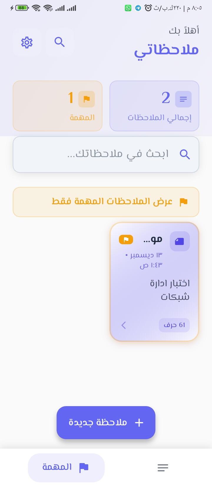
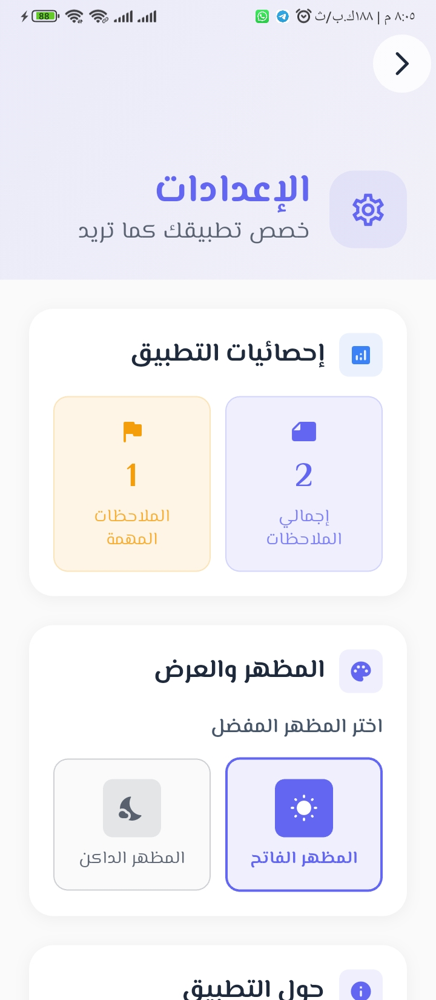

# 📝 ملاحظاتي — My Notes App

**تطبيق بسيط وفعّال لتدوين الملاحظات وتنظيم الأفكار بسهولة وأمان**

---

## 📖 عن التطبيق | About

**ملاحظاتي** هو تطبيق مخصص لتدوين الملاحظات وتنظيم الأفكار بطريقة بسيطة وسهلة الاستخدام.  
يتيح التطبيق للمستخدم إنشاء الملاحظات وتعديلها وحفظها للرجوع إليها لاحقًا، مع واجهة واضحة تساعد على الاستخدام السلس دون تعقيد.  
تم تطوير التطبيق ليكون مناسبًا للاستخدام اليومي في الدراسة أو العمل أو الاستخدام الشخصي.

**My Notes** is a dedicated note-taking app designed to organize your thoughts simply and intuitively.  
It allows users to create, edit, and save notes for later reference, with a clean interface that ensures a smooth experience without complexity.  
The app was built for daily use — whether for studying, work, or personal organization.

---

## ✨ المميزات | Features

| الميزة | Feature |
|--------|---------|
| 📝 إنشاء وتعديل الملاحظات | Create & Edit Notes |
| ⭐ تمييز الملاحظات المهمة | Mark Important Notes |
| 🔍 البحث السريع في الملاحظات | Fast Notes Search |
| 📊 إحصائيات الملاحظات | Notes Statistics |
| 🌙 الوضع الداكن والفاتح | Dark & Light Mode |
| 🗂️ فلترة الملاحظات المهمة | Filter Important Notes |
| 🗑️ حذف الملاحظات | Delete Notes |
| ℹ️ معلومات تفصيلية للملاحظة | Detailed Note Info |
| ⚙️ إعدادات قابلة للتخصيص | Customizable Settings |

---

## 📱 لقطات الشاشة | Screenshots

### شاشة البداية | Splash Screen

---

### الصفحة الرئيسية | Home Screen

---

### إضافة ملاحظة جديدة | Add New Note

---

### عرض تفاصيل الملاحظة | Note Detail View

---

### تحرير الملاحظة | Edit Note

---

### الملاحظات المهمة | Important Notes Filter

---

### الإعدادات | Settings

| Tech Stack

- **Flutter** — إطار عمل التطبيق | App Framework
- **Dart** — لغة البرمجة | Programming Language
- **Local Storage** — حفظ البيانات محلياً | Local Data Persistence

---

## 👨‍💻 المطور | Developer

---

## 📄 الترخيص | License

هذا المشروع مرخص تحت رخصة MIT — انظر ملف [LICENSE](LICENSE) للتفاصيل.  
This project is licensed under the MIT License — see the [LICENSE](LICENSE) file for details.
